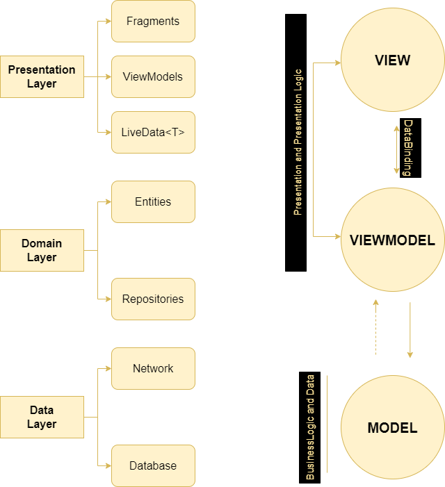

# Fodamy

It is a recipe application where you can add recipes and make comments.

## Screenshots

## Clean Architecture

I used modular architecture for clean architecture.Also I separated user and background processes using MVVM.
Inside the data module I have dto and data classes.

## Tech Stack

List of the technologies that i use in app.

Languages
---------

- [Kotlin](https://kotlinlang.org)

Libraries
---------

- [Android Jetpack](https://developer.android.com/jetpack/)
    - Data Binding
    - Lifecycles
    - LiveData
    - Room
    - Navigation Component
 
- [Paging 3](https://developer.android.com/topic/libraries/architecture/paging/v3-overview)
- [Retrofit](https://square.github.io/retrofit/)
- [Dagger Hilt](https://developer.android.com/training/dependency-injection/hilt-android)
- [Glide](https://github.com/bumptech/glide)

Tools
-----
- [Postman](https://www.getpostman.com)
- [Ktlint](https://github.com/pinterest/ktlint)

Design
-----

- Material Design

